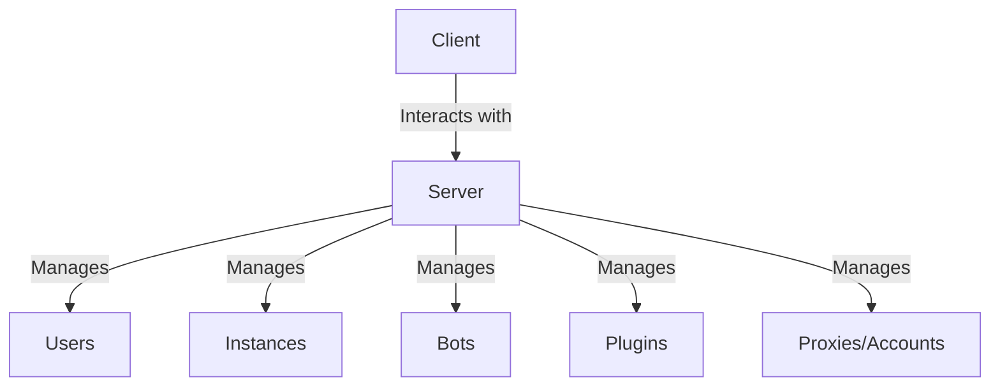

# Terminology

Learn about terms used in the documentation and the API.

## Server/Client

Server and client in SoulFire refer to the two main components of the software.
They have both their respective roles and features outlined below.

### Server

Also known as the **backend** or **server-side** component, the SoulFire server is the part of SoulFire that manages the users, bots and instances.

- **Users**: The server manages the users and their permissions.
- **Instances**: The server manages the instances and their configurations.
- **Bots**: The server manages the bots of instances and the attacks as a whole.
- **Plugins**: SoulFire plugins are loaded and managed by the server.
- **Proxies/Accounts**: The server manages the proxies and accounts used by the bots.

### Client

Also known as the **frontend** or **client-side** component, the client is the part of SoulFire that interacts with the SoulFire server.
A client logs into the SoulFire server and tells it what to do.
A GUI client has a graphical user interface, while a CLI client has a command-line interface.
A client can also be an API client, which means you can create custom software that interacts with the SoulFire server using the SoulFire API.

- **GUI**: The client can be a graphical user interface.
- **CLI**: The client can be a command-line interface.
- **API**: The client can be an API client.
- **Interactions**: The client interacts with the server to manage users, instances, bots, plugins, proxies and accounts.

Clients can connect to any SoulFire server, as long as they have the correct credentials and use the same API version.

### Chart

This chart visualizes the relationship between the server and the client.

