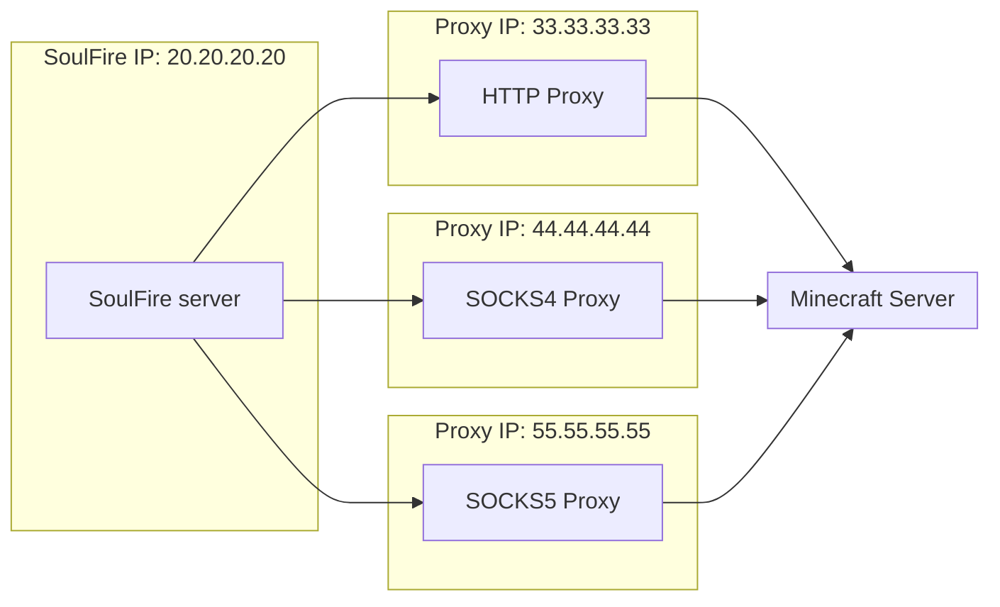
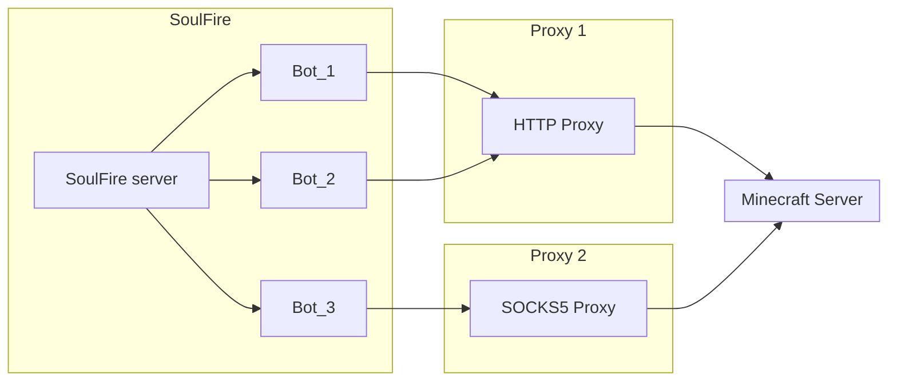

# Import Proxies

SoulFire allows you to use proxies to hide your IP address and bypass IP limits on servers.

## How do proxies work?

Proxies work by hiding your IP similar to how VPNs work.
When you start an attack, SoulFire will connect through the proxies you provide instead of directly connecting to the server.
This way, the server will see the proxy IP address instead of the IP address of your computer/server.

Here is an example of how proxies work:



Your setup may use more proxies/only one type of proxy, but the concept is the same.

## Looking for proxies?

There are many websites that offer free proxies, but be careful as many of them are not reliable or secure.

If you need a good proxy service, I recommend [Webshare](https://www.webshare.io/?referral_code=36gneippfiwt)
(I get commissions for purchases made through this link).
I've used Webshare for my own projects and tried other services such as [ProxyScrape](https://proxyscrape.com/),
but they come nowhere close to the quality of Webshare.
Webshare offers both free and premium proxies and is a reliable and secure service.

## Proxy types

SoulFire supports HTTP, SOCKS4 and SOCKS5 proxies.

Select the proxy type in the GUI or CLI and use one of these formats with one proxy per line:

### HTTP

```text
ip:port <- no authentication
ip:port:username:password <- authentication
```

### SOCKS4

```text
ip:port <- no authentication
ip:port:username <- authentication (socks4 doesn't support passwords)
```

### SOCKS5

```text
ip:port <- no authentication
ip:port:username:password <- authentication
```

### URI

This format allows you to use multiple proxy types in one file.

```text
socks5://ip:port <- socks5 & no authentication
socks5://username:password@ip:port <- socks5 & authentication
socks4://ip:port <- socks4 & no authentication
socks4://username@ip:port <- socks4 & authentication
http://ip:port <- http & no authentication
http://username:password@ip:port <- http & authentication
```

## Multiple bots on one proxy?

Yes, you can run multiple bots on one proxy.
This is useful if you have a limited number of proxies and want to run more bots than proxies.
Please be aware some servers can detect this and ban the proxy, so use this feature with caution.
Many servers work by limiting the amount of connections per IP, so if you run too many bots on one proxy, the server may not allow more connections from that proxy.

SoulFire defaults to `-1` connections per proxy, which means unlimited bots can connect through one proxy.
But it will always try to evenly distribute the bots across all proxies.
If you set any value like `10`, SoulFire will only allow 10 bots to connect through one proxy.
If you request more bots than the `limit per proxy * amount of proxies`, SoulFire will reduce the amount of bots to the maximum possible amount.

Here is an example of how multiple bots on one proxy work:



## Shuffling proxies

SoulFire supports shuffling proxies, but it's disabled by default.
When enabled, SoulFire will shuffle the proxies randomly before starting the attack.
If disabled, SoulFire will use the proxies in the order they are in the settings.

The shuffling feature is useful if you want to randomize the order of the proxies to make it harder for servers to detect which proxies are bots on subsequent attacks.
